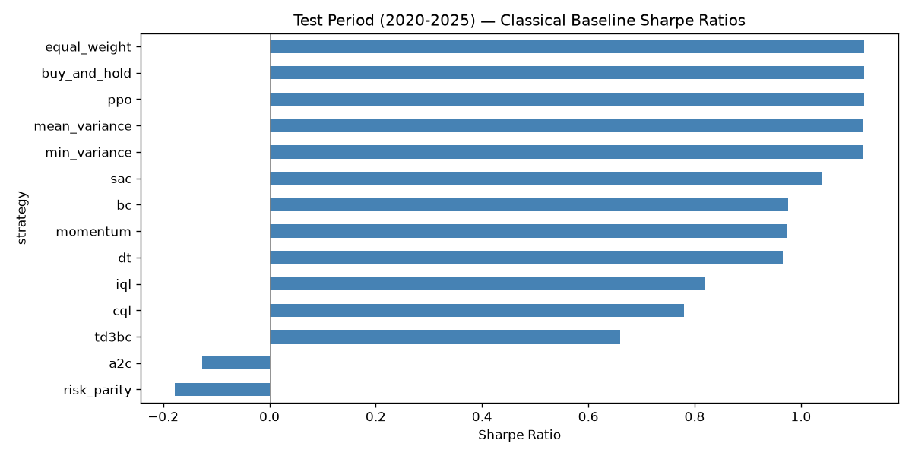
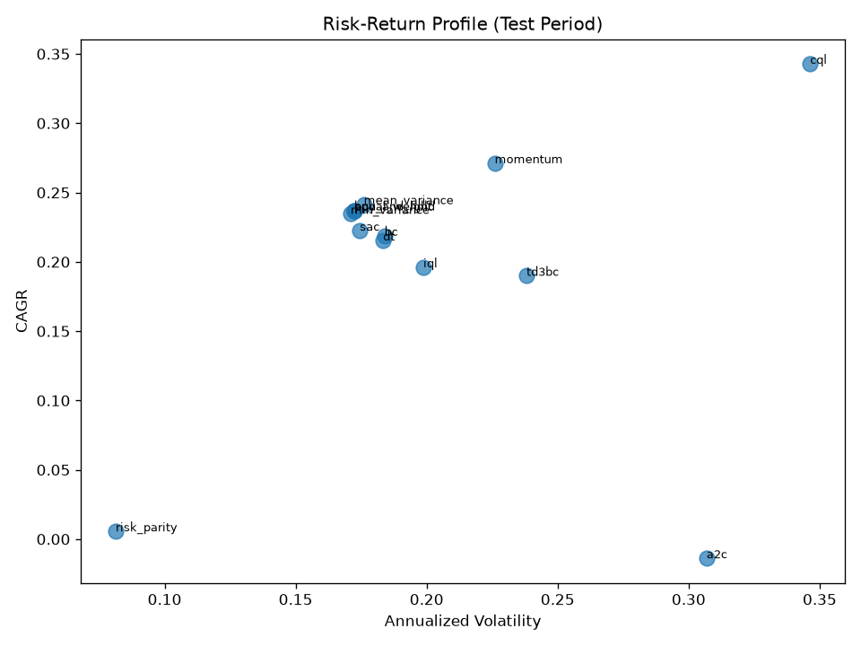
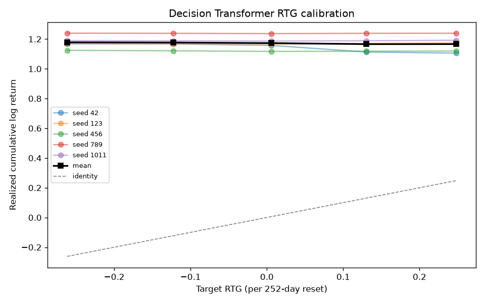
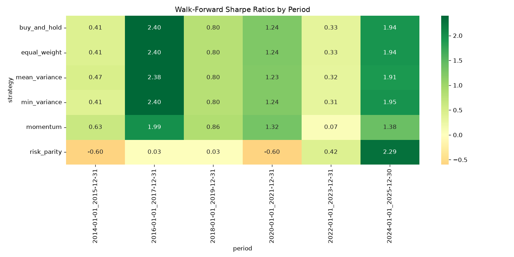

# Paper walkthrough: algorithms, math, and implementation

This note is a learning companion to [`paper/main.tex`](../paper/main.tex). It maps each section of the paper onto the code, spells out the math the way it is *implemented* (including simplifications), and explains the Universe A test results (2020–2025, 5 seeds).

Figures live under `results/figures/eval/` (regenerate with `python scripts/run_eval_plots.py`). Pipeline overview: [`implementation_summary.md`](../implementation_summary.md).

**One-sentence thesis of the paper.** On this long-only, cost-aware MDP, a flat \(1/N\) book is so strong that Decision Transformer matches Behavior Cloning and neither beats buy-and-hold on Sharpe; RTG conditioning is unused.

---

## 1. Shared MDP (every algorithm)

File: [`src/env.py`](../src/env.py).

Daily rebalancing is the finite-horizon MDP
\(\mathcal{M}=\langle\mathcal{S},\mathcal{A},P,R,\gamma,\rho_0,T_{\mathrm{ep}}\rangle\).
Prices \(\{y_t\}\) are **exogenous**: the agent cannot change tomorrow’s market.

| Symbol | Meaning | Code |
|--------|---------|------|
| \(N=14\) | Investable assets (Universe A), including cash + synthetic 10Y | `UNIVERSE_A_ASSETS` in [`src/data_loader.py`](../src/data_loader.py) |
| \(y_t\) | Gross relative returns \(p_t/p_{t-1}\) | `compute_price_returns` |
| \(a_t=w_t\in\Delta^{N-1}\) | Long-only weights, \(\sum_i w_i=1\), \(w_i\ge 0\) | softmax / Dirichlet mean / Duchi projection |
| \(s_t\in\mathbb{R}^{2580}\) | Flattened 20-day lookback of returns, technicals, macro, events. **Not** previous weights | [`src/features.py`](../src/features.py) |
| \(R_t\) | \(\ln\max(a_t^\top y_t-\mu\|a_t-a_{t-1}\|_1,\varepsilon)\) | `compute_log_reward`, \(\mu=0.001\), \(\varepsilon=10^{-8}\) |
| \(\gamma\) | \(1\) for DT/RTG; \(0.99\) inside value-based RL | — |
| \(T_{\mathrm{ep}}\) | 252 days in training episodes; full split at eval | `env.episode_length` |

**Turnover caveat.** The env stores the last *target* \(a_{t-1}\), not mark-to-market holdings \(w'\propto a_{t-1}\odot y_t\). Buy-and-hold and equal-weight are therefore the **same policy** in this MDP (both always emit \(1/N\), so \(\|a_t-a_{t-1}\|_1=0\)).

**Simplex projection (Duchi 2008).** Used by MVO/min-var and as a safety net on RL actions:

\[
\theta=\frac{\sum_{j=1}^{\rho}u_{(j)}-1}{\rho},\qquad
w=\max(v-\theta,0),\quad w\leftarrow w/\|w\|_1
\]

where \(u\) is \(v\) sorted descending and \(\rho\) is the largest index with \(u_i > (\sum_{j\le i}u_j-1)/i\). Batched in `project_to_simplex_batch`.

**Offline data.** 18 behavior policies × 200 windows = 3,600 episodes (format v2 in [`src/trajectories.py`](../src/trajectories.py)). Shared global `states` matrix; per-episode `actions`, `rewards`, `rtg`.

---

## 2. Pipeline and architecture choices

```
prepare → features → trajectories → train (8 algos × 5 seeds) → evaluate
```

| Choice | Why |
|--------|-----|
| Causal GPT, not HF transformers | Small custom model, full control of the (RTG, S, A) interleaving and padding mask |
| Softmax (or Dirichlet) on the head | Hard simplex; no Lagrange multipliers at inference |
| MSE on **last** context step only | Matches Decision Transformer practice; cheaper than summing over \(K\) |
| `steps_per_epoch: 200`, batch 256 | GTX 1070 saturates at ~1,300 samples/s; a full pass is ~10 min/epoch (~87 h for two transformers × 5 seeds × 50 epochs). 200×256×50 ≈ 3 passes over the 816k training samples |
| No AMP | Pascal (compute 6.1) has no tensor cores; fp16 would likely slow training |
| `last_state_only` for RL | MLP agents do not need the \(K\)-token gather |
| 5 seeds | Report mean ± std; paper tables use this |

Training loop: [`src/trainer.py`](../src/trainer.py). Inference wrappers: [`src/eval/model_policy.py`](../src/eval/model_policy.py) (`DTPolicy`, `AgentPolicy`).

Headline comparison (classical + learned means):



Risk–return (CAGR vs volatility):



---

## 3. Classical algorithms

All live in [`src/policies.py`](../src/policies.py). They ignore \(s_t\) and use only trailing \(y\). Test window: 2020–2025.

### 3.1 Buy-and-hold and equal-weight

**Math.** \(a_t=\mathbf{1}/N\) for all \(t\).

**Implementation.** `BuyAndHold` and `EqualWeight` both copy a cached uniform vector. Under target-based turnover they produce identical backtests (Sharpe **1.118**, CAGR **23.7%**, max DD **−23.3%**, turnover \(\sim 0\)).

**How to read the result.** This is the bar every learned method failed to clear on Sharpe. It is *not* a drifted buy-and-hold (weights never ride winners).

### 3.2 Momentum

**Math.** Lookback \(L=60\), top-\(k\) with \(k=\lfloor N/3\rfloor=4\):

\[
c_{i,t}=\prod_{\ell=1}^{L} y_{t-\ell,i}-1,\qquad
a_{i,t}=\frac{1}{k}\mathbf{1}[i\in\mathrm{arg\,top}_k\,c_{\cdot,t}].
\]

If \(t<L\), fall back to \(1/N\).

**Implementation.** `Momentum.__call__` / `precompute`. Schedules cached in `data/processed/policy_weights.npz`.

**Result.** Best **CAGR 27.1%**, Sharpe **0.97**, max DD **−32.0%**, mean daily turnover **15.1%**. Wins 2020–2021 walk-forward, loses 2022–2023. High turnover is the cost of rotating the top-4 book every day.

### 3.3 Mean-variance (max-Sharpe)

**Math.** On a 252-day window, Ledoit–Wolf \(\hat\Sigma\), sample mean \(\hat\mu\). Projected gradient on the simplex (\(200\) steps, \(\eta=0.05\)):

\[
w\leftarrow \Pi_{\Delta}\bigl(w-\eta(\hat\mu-\hat\Sigma w)\bigr).
\]

(The gradient of \(w^\top\mu-\tfrac12 w^\top\Sigma w\) is \(\mu-\Sigma w\).)

**Implementation.** `_optimize_weights_batch` + `MeanVariance`. Fallback \(1/N\) until the window is full.

**Result.** CAGR **24.2%**, Sharpe **1.116** — statistically the same as \(1/N\) (bootstrap CI on Sharpe difference covers 0). Ledoit–Wolf + simplex projection mostly recovers a near-static book, hence turnover only **0.7%**.

### 3.4 Min-variance

**Math.** Same machinery, gradient \(2\hat\Sigma w\) (minimize \(w^\top\Sigma w\)).

**Result.** CAGR **23.5%**, Sharpe **1.116**, turnover \(\approx 0\). Again indistinguishable from \(1/N\) on this universe and window.

### 3.5 Risk parity (inverse-vol)

**Math.** Lookback 60:

\[
a_{i,t}\propto \frac{1}{\mathrm{std}(y_{\cdot,i})+10^{-8}}.
\]

This is **not** full ERC (equal risk contribution with covariances); it ignores correlations.

**Result.** Failed baseline: CAGR **0.6%**, Sharpe **−0.18**. Cash, bond, and metals dominate the inverse-vol mix and miss the 2020–2025 equity run. The paper flags the 60-day window as a likely mismatch, not a proof that risk parity cannot work.

### 3.6 Behavior mixture (training only)

Not a test strategy. Fills \(\mathcal{D}\) so DT/BC have something to clone:

- Dirichlet noise around MVO, momentum, equal-weight with \(\alpha\in\{5,15,50\}\) (larger \(\alpha\) = closer to the base).
- Random \(\mathrm{Dirichlet}(\alpha\mathbf{1})\) with \(\alpha\in\{0.5,1,2\}\).

Sampling uses the gamma trick: \(g_i\sim\mathrm{Gamma}(\alpha_i,1)\), \(w=g/\|g\|_1\). Vectorized in `NoisyPolicy.sample_episode_weights` (statistically equivalent to `rng.dirichlet`, not bit-identical).

---

## 4. Sequence models

Shared training: AdamW \(10^{-4}\), weight decay \(10^{-4}\), grad clip \(1.0\), MSE on the **last** step of a \(K=30\) context, 50 epochs × 200 steps, batch 256, 5 seeds.

### 4.1 Decision Transformer

Files: [`src/models/decision_transformer.py`](../src/models/decision_transformer.py), loss in [`src/trainer.py`](../src/trainer.py) `train_dt(..., use_rtg=True)`, rollout in `DTPolicy`.

#### Architecture

Causal GPT. Per day three tokens \((\hat R_t, s_t, a_t)\), so a window of \(K=30\) is **90 tokens**.

| Piece | Shape / choice |
|-------|----------------|
| `embed_rtg` | Linear \(1\to 192\) |
| `embed_state` | Linear \(2580\to 192\) |
| `embed_action` | Linear \(14\to 192\) |
| `pos_embed` | learned, length \(3K\) |
| Blocks | 4 × (LN → causal attention 6 heads → LN → GELU MLP \(4d\)) |
| Head | Linear \(192\to 14\) then **softmax** |

Attention: `scaled_dot_product_attention`. If the padding mask is all ones, it is dropped so the fused `is_causal=True` kernel runs. Otherwise causal \(\land\) padding, with the **diagonal forced on** so a fully masked row cannot softmax to NaN.

Tokens at positions \(3k, 3k+1, 3k+2\) are RTG, state, action. The action head reads **state** positions \(1,4,7,\ldots\) (`x[:, 1::3]`). Because the action token sits *after* the state token, the causal mask hides \(a_t\) from the prediction of \(a_t\). Training still writes the dataset action into that slot; inference **zero-fills** it. A unit test checks last-step predictions are invariant to that slot.

#### Math

Return-to-go (undiscounted):

\[
\hat R_t=\sum_{t'=t}^{T_{\mathrm{ep}}-1} R_{t'}.
\]

Model input is \((\hat R_t-\mu_{\mathrm{RTG}})/\sigma_{\mathrm{RTG}}\) with \(\mu_{\mathrm{RTG}}=-0.002\), \(\sigma_{\mathrm{RTG}}=0.139\).

Loss (implemented):

\[
\mathcal{L}=\bigl\|\,f_\theta(\hat R_{t-K+1:t},\,s_{t-K+1:t},\,a_{t-K+1:t})_{[-1]}-a_t^{\mathrm{data}}\bigr\|_2^2.
\]

Inference budget: start at the 90th percentile of training \(\{\hat R_0\}\), then \(\hat R\leftarrow\hat R-R_t\), **reset every 252 days** on multi-year tests so the scalar stays in-distribution.

#### Results

Mean over 5 seeds: CAGR **21.5%**, Sharpe **\(0.966\pm 0.119\)**, max DD **−27.2%**, turnover **6.1%**. Does **not** beat BC or buy-and-hold.

RTG calibration (target quantile vs realized log return) is essentially **flat**, slightly inverse (mean Sharpe \(1.01\to 0.97\) as the quantile goes \(0.1\to 0.9\)):



**Why RTG is unused.** (1) MSE clones \(\mathcal{D}\) and never *rewards* changing \(a\) with \(\hat R\). (2) \(\sigma_{\mathrm{RTG}}\) is small (~0.14 log-return per 252-day episode) while the test path is ~1,500 days. (3) Resetting every 252 days severs a six-year target. DT therefore behaves like a slightly noisier BC.

### 4.2 Transformer BC

File: [`src/models/bc.py`](../src/models/bc.py) `TransformerBC`.

**Math.** Same GPT, tokens \((s_t,a_t)\) only (2 tokens/day, state at even indices `x[:, 0::2]`). Same last-step MSE, **no RTG**.

**Why it exists.** Ablation of return conditioning. If DT \(\approx\) BC, RTG is not doing work.

**Result.** CAGR **21.9%**, Sharpe **\(0.976\pm 0.095\)**. Tightest learned clone of the behavior mixture; the correct control for DT. Slightly *better* than DT on mean Sharpe (overlapping seed ranges).

`MLPBC` is implemented but **not** in the 8-model sweep.

---

## 5. Offline RL algorithms

File: [`src/models/offline_rl.py`](../src/models/offline_rl.py). All use `last_state_only` batches: \((s,a,r,s',d)\) with genuine next states and `dones` at episode ends. Actors: `SimplexActor` (MLP \(2580\to 256\to 256\to 14\), softmax). Critics: twin \(Q(s,a)\) MLPs. Polyak \(\tau=0.005\), \(\gamma=0.99\), Adam \(3\times 10^{-4}\).

**Bugs that had to be fixed before the sweep** (or the table is fiction): \(s'=s\) (self-Bellman), frozen target nets, CQL `logsumexp` over the *batch*, IQL \(V\) chasing live \(Q\), checkpoints saving the algorithm *name*. Covered by [`tests/test_training_regressions.py`](../tests/test_training_regressions.py).

### 5.1 TD3+BC

**Math.** Twin delayed DDPG + a BC tether (Fujimoto & Gu):

\[
y = r+\gamma(1-d)\min_{i=1,2}Q_{\theta'_i}(s',\pi_\phi(s')),
\]
\[
\mathcal{L}_Q=\sum_{i=1}^2\|Q_{\theta_i}(s,a)-y\|_2^2,
\]
\[
\mathcal{L}_\pi=-\alpha\,\mathbb{E}[Q_{\theta_1}(s,\pi_\phi(s))]+\|\pi_\phi(s)-a_{\mathrm{data}}\|_2^2,
\]

with \(\alpha=2.5\), \(\theta'\leftarrow(1-\tau)\theta'+\tau\theta\).

**Implementation notes.** No target *actor* and no target-action noise (simplex + softmax). `alpha` multiplies \(Q\), it is not the usual \(\lambda\) that scales BC by \(|Q|\).

**Result.** Weakest serious offline agent: Sharpe **\(0.66\pm 0.23\)**, CAGR **19.0%**, DD **−35%**. BC term plus a high-dimensional state is not enough to beat \(1/N\); seed variance is large.

### 5.2 IQL (Implicit Q-Learning)

**Math.** Fit \(V\) with expectile \(\tau_e=0.7\) to a *frozen* target \(Q\), then TD on \(Q\) using \(V(s')\), then advantage-weighted BC:

\[
\mathcal{L}_V=\mathbb{E}\bigl[|\tau_e-\mathbf{1}_{Q-V<0}|(Q_{\theta'}(s,a)-V_\psi(s))^2\bigr],
\]
\[
y=r+\gamma(1-d)V_\psi(s'),\qquad
\mathcal{L}_Q=\sum_i\|Q_{\theta_i}(s,a)-y\|_2^2,
\]
\[
\mathcal{L}_\pi=\mathbb{E}\bigl[e^{\mathrm{clip}((Q-V)/T,\,100)}\,\|\pi(s)-a\|_2^2\bigr],\quad T=3.
\]

**Why a target \(Q\).** Fitting \(V\) to live \(Q\) is the deadly triad; loss went to \(10^4\). After Polyak, value loss is ~\(5\times 10^{-4}\).

**Result.** Sharpe **\(0.82\pm 0.18\)**, CAGR **19.6%**. Conservative (expectile + AWR) and below BC: it down-weights the high-return, high-turnover trajectories in \(\mathcal{D}\) instead of beating \(1/N\).

### 5.3 CQL (Conservative Q-Learning)

**Math.** TD plus a CQL(H) penalty over \(N_a=10\) random simplex actions \(\tilde a\sim\mathrm{softmax}(\mathcal{N})\), \(\alpha_{\mathrm{CQL}}=1\):

\[
\mathcal{L}_Q=\mathrm{TD}
+\alpha_{\mathrm{CQL}}\sum_{i=1}^2\Bigl(\log\sum_{j=1}^{N_a}e^{Q_{\theta_i}(s,\tilde a_j)}-\mathbb{E}_{a\sim\mathcal{D}}[Q_{\theta_i}(s,a)]\Bigr),
\]
\[
\mathcal{L}_\pi=-\mathbb{E}[Q_{\theta_1}(s,\pi(s))]+\|\pi(s)-a_{\mathrm{data}}\|_2^2.
\]

**Implementation trap.** `logsumexp` over the **batch** is \(\approx 2\log B\) and does not penalize OOD actions. The code logsumexps over the action-sample axis. The actor has a BC anchor so \(-\,Q\) cannot drift to \(-16\).

**Result.** Highest **CAGR 34.3%** but Sharpe only **\(0.78\pm 0.19\)**, vol **34.6%**, max DD **−50%**. Seed 789 alone has **53%** CAGR — a risk-on outlier, not a stable Sharpe engine. Walk-forward: 0.19 / 0.95 / −0.02 / 1.44. CQL *does* leave the data support (that is the point of \(-\,Q\)) and pays for it in drawdown.

---

## 6. “Online” reference algorithms

File: [`src/models/online_rl.py`](../src/models/online_rl.py). **Not true online RL.** They take one gradient step per offline batch. Treat as extra imitation/Q variants, not as an online upper bound.

Dirichlet actor (PPO, SAC): \(\alpha=\mathrm{softplus}(f(s))+1\), then \(\mathrm{nan\_to\_num}\) and clamp (guards the old NaN). Inference uses \(\mathbb{E}[\mathrm{Dir}(\alpha)]=\alpha/\|\alpha\|_1\).

### 6.1 PPO (simplified)

**Intended math.** Clipped surrogate on \(\rho_t=\pi/\pi_{\mathrm{old}}\).

**What the code actually does.**

```text
ratio = exp(log_prob - log_prob.detach())   # = 1 identically
```

So the clip never fires. Advantage is \(r-V(s)\) with **no GAE, no bootstrap from \(s'\)**. Critic fits \(V\to r\) (one-step reward, not return). This is closer to a broken one-step A2C than to PPO.

**Result.** Sharpe **1.118**, std **0**, identical to buy-and-hold on **every seed**. The Dirichlet mean collapsed to uniform. It “wins” among learned methods by copying \(1/N\), not by allocating.

### 6.2 SAC (simplified)

**Intended math.** Soft Q with entropy \(\alpha\log\pi\).

**What the code actually does.** One critic (not twins). Target \(r+\gamma(1-d)Q(s',\pi(s'))\). Actor \(\mathcal{L}=-\mathbb{E}[Q(s,\pi(s))]\) — **entropy weight `self.alpha` is unused**. Dirichlet sample/mean for \(\pi(s)\).

**Result.** Best *non-collapsed* learned Sharpe: **\(1.039\pm 0.143\)**, CAGR **22.2%**, still below \(1/N\). Mild turnover (5.8%). Closest learned policy to the baseline besides PPO.

### 6.3 A2C

**Math (implemented).** Softmax actor, \(A=r-V(s)\),

\[
\mathcal{L}_\pi=-\mathbb{E}\bigl[A\cdot a_{\mathrm{data}}^\top\log\pi(s)\bigr],\qquad
\mathcal{L}_V=\|V(s)-r\|_2^2.
\]

That is a cross-entropy toward **dataset** actions weighted by advantage, not a sampled on-policy A2C.

**Result.** Broken as a portfolio: CAGR **−1.4%**, Sharpe **\(-0.13\pm 0.34\)**, turnover **>1 per day** (rebalancing the whole book constantly). Ignore for allocation; keep only as a “this interface can train” check.

---

## 7. Reading results across algorithms

Walk-forward Sharpe (classical heatmap from `walkforward_metrics.csv`):



Out-of-sample folds (learned = mean over seeds):

| Fold | BAH | Momentum | DT | BC | SAC | CQL |
|------|-----|----------|----|----|-----|-----|
| 2018–19 | 0.80 | 0.86 | 0.79 | 0.78 | 0.79 | 0.19 |
| 2020–21 | 1.24 | 1.32 | 1.07 | 1.06 | 1.09 | 0.95 |
| 2022–23 | 0.33 | 0.07 | 0.25 | 0.28 | 0.33 | −0.02 |
| 2024–25 | 1.94 | 1.38 | 1.84 | 1.85 | 1.87 | 1.44 |

Learned curves **track** buy-and-hold and never lead. 2014–2017 folds overlap training (`in_sample=True`) and are not performance.

**Statistics.** Circular block bootstrap (block 20, 1,000 reps) and Ledoit–Wolf vs buy-and-hold in [`src/eval/stats.py`](../src/eval/stats.py). Deflated Sharpe uses \(n_{\mathrm{trials}}=46\) (every classical row **and** every seed), which drives DSR \(\approx 0\) for everyone, including BAH — too conservative to be useful.

**Mental model.**

```
1/N  (BAH = EW = PPO-collapsed)
  ↑ SAC slightly below
  ↑ BC ≈ DT  (sequence clone of D, RTG off)
  ↑ IQL, TD3+BC  (conservative / weak)
  ↑ CQL  (high CAGR, ugly risk)
  ↑ Momentum  (high CAGR, high turnover)
  ↓ Risk parity, A2C
```

---

## 8. Inference path (how tables get filled)

1. `training_manifest.json` lists `dt_seed42` → checkpoint path; skip `failed:`.
2. **DT/BC:** `DTPolicy` keeps a rolling \(K\) buffer, decrements RTG from `env.history[-1]["reward"]`, resets every 252 steps.
3. **RL:** `AgentPolicy` loads `modules`, `get_action`, `project_to_simplex`.
4. `backtest_policy` → `PortfolioEnv.run_policy` → metrics in [`src/eval/metrics.py`](../src/eval/metrics.py).
5. Means over seeds → `headline_test_metrics.csv` / `learned_test_metrics.csv`.

---

## 9. Challenges (short)

Documented at length in the paper §Challenges. For study, the load-bearing ones are:

1. **Exogenous + costs** ⇒ turnover needs real edge; \(1/N\) already has Sharpe 1.12.
2. **RTG unused** ⇒ DT is BC with extra tokens.
3. **RL correctness** ⇒ always check \(s'\), target nets, and what `logsumexp` is over.
4. **PPO/SAC/A2C** are not textbook algorithms here (ratio \(=1\), unused entropy, offline batches).
5. **Hardware** forced 200 steps/epoch and no AMP.
6. **BAH = EW** is an artifact of target-based turnover.

---

## 10. Where to read next

| Topic | File |
|-------|------|
| Paper | [`paper/main.tex`](../paper/main.tex) |
| Hyperparameters | [`configs/config.yaml`](../configs/config.yaml) |
| Env / reward | [`src/env.py`](../src/env.py) |
| Classical policies | [`src/policies.py`](../src/policies.py) |
| DT / BC | [`src/models/decision_transformer.py`](../src/models/decision_transformer.py), [`src/models/bc.py`](../src/models/bc.py) |
| Offline / online RL | [`src/models/offline_rl.py`](../src/models/offline_rl.py), [`src/models/online_rl.py`](../src/models/online_rl.py) |
| Train / eval | [`src/trainer.py`](../src/trainer.py), [`src/eval/`](../src/eval/) |
| Numbers | [`results/tables/`](../results/tables/) |
